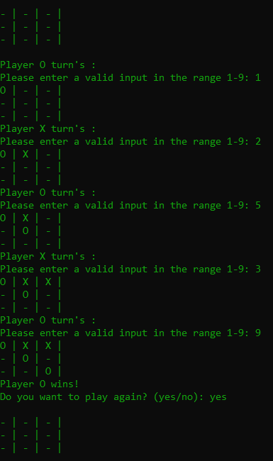

## TicTacToe on Console

### TicTacToe Algorithm

1. **Initialize the Game Board**: Create a 3x3 grid to represent the Tic Tac Toe board. This can be represented using a 2D array or any other suitable data structure.

2. **Display the Game Board**: Create a function to display the current state of the board to the players.

3. **Player Input**: Allow players to input their moves. You'll need to handle input validation to ensure that the input is within the valid range (1-9) and the chosen cell is not already occupied.

4. **Update the Board**: Update the game board with the player's move.

5. **Check for Win or Draw**: After each move, check if there's a winner or if the game has ended in a draw. You'll need to check for three consecutive symbols (X or O) in a row, column, or diagonal.

6. **Switch Players**: After each move, switch to the next player's turn.

7. **Repeat Until Game Ends**: Keep repeating steps 3-6 until there's a winner or the game ends in a draw.

8. **Declare the Winner or Draw**: Once the game ends, declare the winner (if any) or announce that the game ended in a draw.

This basic algorithm outlines the steps needed to create a functional Tic Tac Toe game in Ruby. You'll need to implement each step with the appropriate Ruby code.
